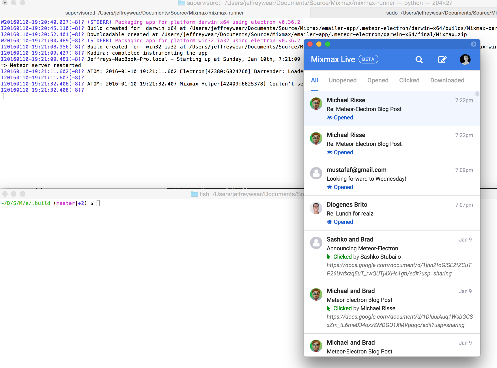

# meteor-electron

meteor-electron provides comprehensive build- and run-time support for desktop Meteor applications.
Its ultimate goal is to build `meteor add-platform desktop`.

Some of the things it does:

* automatically builds and launches a desktop application, rebuilding when code changes
* defines feature detection APIs and a bridge between web and native code
* serves downloads of your application and update feeds



## Disclaimer

If you're visiting from [the introductory blog post](https://mixmax.com/blog/turnkey-electron-apps-with-meteor),
welcome! This package is already being used in production, but the documentation still needs a bit
of work and it has not been published to Atmosphere yet. If you'd like to try it out, clone/copy it
into your project's `packages` directory and then add it as in [Installation](#installation).

We ([@rissem](https://twitter.com/rissem) and [@wearhere](https://twitter.com/wear_here)) are
presenting about this at the [1/21 Meteor Night](http://www.meetup.com/Meteor-SFBay/events/227198908/)
and we will have addressed the above issues by that date.

## Installation

`meteor add quark:electron`

After adding the package, an electron app wrapper will be built and opened.

This app, as well as the ready-to-distribute binaries (see [Deploy](#deploy)), is built within
`YOUR_PROJECT_DIRECTORY/.meteor-electron`. This allows the apps to be easily located as well as the
apps to be cached for speedier startup. You should add this directory to your
`.gitignore`.

## Building for Windows on Mac

1. Install [homebrew](http://brew.sh/)
2. `brew update`
3. `brew install wine`
4. Specify a Windows build in your settings (otherwise defaults to current platform/arch).

```json
{
  "electron": {
    "builds": [
      {"platform": "win32",
       "arch": "x64"}
    ]
  }
}
```

## Configuration
Limited configuration is possible via `Meteor.settings.electron` For example

```
{
  "electron": {
    "name": "MyApp",

    "icon": {
      // Relative to your app's project directory.
      "darwin": "private/MyApp.icns",
      "win32": "private/MyApp.ico"
    },

    // Must conform to Semver: https://docs.npmjs.com/getting-started/semantic-versioning.
    "version": "0.1.0",

    "description": "A really cool app.",

    // If unset, defaults to the ROOT_URL environment variable.
    "rootUrl": "https://myapp.com",

    // If you want your app to open to a non-root URL. Will be appended to the root URL.
    "launchPath": "/app/landing",

    // URLs from which downloads are served. A CDN is recommended, but any HTTP server will do.
    "downloadUrls": {
      // Copy the output of `grunt-electron-installer` (see [Building and serving an auto-updating Windows app](#building-and-serving-an-auto-updating-windows-app))
      // to this location. Do not rename the files.
      "win32": "https://myapp.com/download/win/",

      // If you wish to host the Windows installers at versioned URLs for caching or archival reasons,
      // use this version of `win32`.
      "win32": {
        // Copy the output of `grunt-electron-installer` (see [Building and serving an auto-updating Windows app](#building-and-serving-an-auto-updating-windows-app))
        // to this location. Do not rename the files.
        "releases": "https://myapp.com/download/win/",

        // If you like, you may copy the `Setup.exe` file created by `grunt-electron-installer` to
        // this location rather than the "releases" location. If the URL contains '{{version}}', it
        // will be replaced with `version`.
        "installer": "https://myapp.com/download/win/{{version}}/MyAppSetup.exe"
      },

      // Place the latest app at this location. If the URL contains '{{version}}', it will be replaced with `version`.
      "darwin": "https://myapp.com/download/osx/{{version}}/MyApp.zip"
    }

    // Must be set to enable auto-updates on Mac.
    "sign": "Developer ID Application: ...",

    // minHeight/maxHeight are also supported.
    "height": 768,

    // minWidth/maxWidth are also supported.
    "width": 1024,

    "frame": true,

    "title-bar-style": "hidden",

    "resizable": true,

    "protocols": [{
      "name": "MyApp",
      "schemes": ["myapp"]
    }],

    // A directory of code to use instead of meteor-electron's default application, relative to your
    // app's project directory. See warning below!
    "appSrcDir": "private/app"
  }
}
```

## Electron-specific code

By default, all client code will be executed in Electron. To include/exclude code use `Electron.isDesktop`

```javascript
if (!Electron.isDesktop()){
  showModal("Have you considered downloading our Electron app?");
}
```

## Deploying

### Building and serving an auto-updating Mac app

1. Set `Meteor.settings.electron.autoPackage` to `true` to ZIP your app for distribution after it is
built.
2. If you wish to enable remote updates, you will need to codesign your application. This requires
that you build your app on a Mac with a [Developer ID certificate](https://developer.apple.com/library/mac/documentation/IDEs/Conceptual/AppDistributionGuide/DistributingApplicationsOutside/DistributingApplicationsOutside.html) installed.
Set `Meteor.settings.electron.sign` to the name of that certificate.
3. Wait for the app to finish building and packaging, then copy
`YOUR_PROJECT_DIRECTORY/.meteor-electron/darwin-x64/final/YOUR_APP_NAME.zip` to a publically-accessible
location.
4. Set `downloadUrls.darwin` in `Meteor.settings.electron` to the URL of the location where you copied the ZIP.
This URL will be served at `/app/download?platform=darwin`.

### Building and serving an auto-updating Windows app

0. Make sure that you have specified `name`, `version`, and `description` in `Meteor.settings.electron`.
1. Build the app [on a Mac](#building-for-windows-on-mac), because changing a Windows application icon
[does not work on Windows at present](https://github.com/maxogden/electron-packager/issues/53).
2. Ensure the URL specified by `Meteor.settings.electron.downloadUrls.win32` has an empty `RELEASES` file.
2. On a Windows machine or in a Windows VM ([not a Mac, at present](https://github.com/atom/grunt-electron-installer/issues/90)),
run the [electron installer grunt plugin](https://github.com/atom/grunt-electron-installer) against your app.
Your Gruntfile should look something like https://github.com/rissem/meteor-electron-test/tree/master/.test.
The value of `remoteReleases` should be your webapp's `ROOT_URL` + '/app/latest'.
3. Copy the output to the server serving `Meteor.settings.electron.downloadUrls.win32`, to be served
from that location.
4. When you publish a new update, run the installer again and it will generate diffs, a new `RELEASES` file,
and new installers. After copying these to `Meteor.settings.electron.downloadUrls.win32` again (overwriting
the `RELEASES` file and installers), apps that check for updates should receive a new version.

The installer for the latest version of your app will be served at `/app/download?platform=win32`.

## Example

[TODO] Link to an awesome chat app

## Q&A

### Q: How is this different from all the other Meteor electron packages?

This package differs from [Electrometeor](https://github.com/sircharleswatson/Electrometeor) and
[Electrify](https://github.com/arboleya/electrify) by *not* baking Meteor into the packaged app.
This makes things significantly simpler, but if you need strong offline support, one of them is a
better solution.

### Q: Can I modify the main process file or the NPM packages for the app?

No. By maintaining control over the main process file, we are able to offer cross-platform builds. Allowing users to modify the main process file or NPM packages could easily break our build process.

### Q: If I can't modify the main process file, how can I create new browser windows, set app notifications and all the other awesome native functionality that Electron gives me?

This project selectively exposes such functionality to the client, in a way that is safe and avoids
memory leaks, via the `Electron` module--see [`client.js`](client.js). To request that this module
expose additional functionality, please [submit a pull request](https://github.com/rissem/meteor-electron/pull/new/master)
or [file an issue](https://github.com/rissem/meteor-electron/issues/new).

You may also substitute your own application code for `meteor-electron`'s default application by
setting the `appSrcDir` settings option. `meteor-electron` will continue to package your application
and serve the application update feed and download URLs, but in-app functionality will be your
responsibility.  **Warning**: this responsibility includes setting up your application window and menu,
checking for remote updates, registering the `Electron` module (that defines `Electron.isDesktop`),
and possibly other things. If you take this route, it's recommended that you start by copying
`meteor-electron`'s `app` directory.

Also, you also probably want to keep your application code in a subdirectory of your application's
`private` directory so that Meteor will observe changes to it and restart the server; when it does
so, `meteor-electron` will rebuild and relaunch the app.

### Q: How do I prevent the Electron app from being automatically built and launched?

Set `Meteor.settings.electron.autoBuild` to `"false"`.
